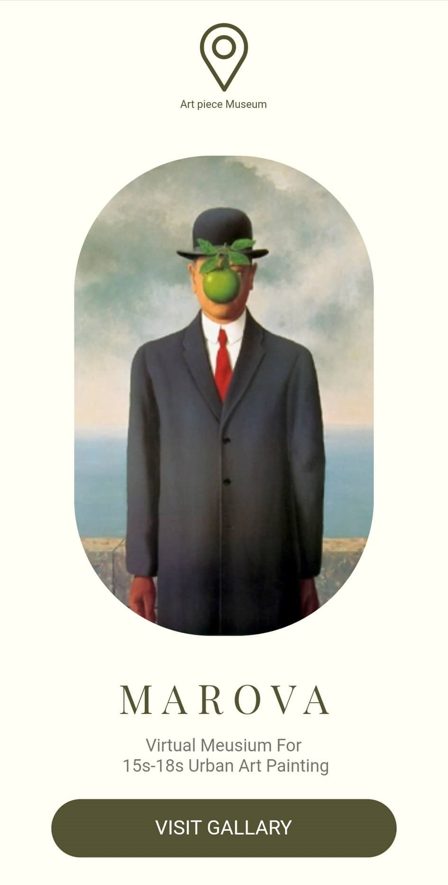
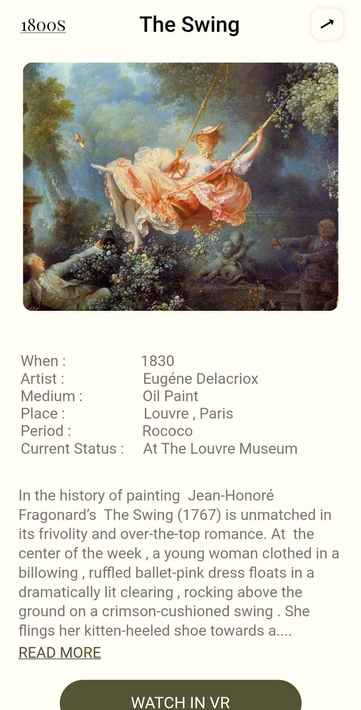
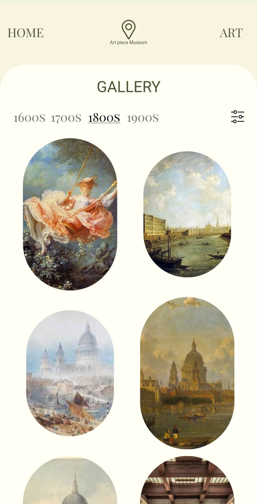

### Hi GitHub community 👋
I developed a Flutter UI app to virtual museum for 15s-18s urban art painting called  ***marova***.
    
### ✨ Installation
-----
 1. Clone this repository:
```bash
git clone <repository-url>
```

2. Run the application:
```bash
flutter run lib/main.dart
```

3. build the Android APK:
```bash
flutter build apk
```
### 🔭 ScreenShots
-----
    


